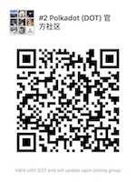

# Polkadot & Substrate 中文资源

## Polkadot 波卡
[Overview - 簡介](https://www.slideshare.net/casperLTH/polkadot)

[Consensus - 共识创新之路](https://www.slideshare.net/casperLTH/polkadot-consensus-innovation)

[Governance - 治理](https://mp.weixin.qq.com/s/yyPaHsU7Nf7sUBVGIq1jbw)

## Substrate

Overview - 簡介
[1](https://www.slideshare.net/casperLTH/substrate-134676336)
[2](https://mp.weixin.qq.com/s/AjQ10yk-VsmS-HdREgjBTQ)

Architecture Design - 架构设计
[1](https://zhuanlan.zhihu.com/p/56383616)
[2](https://zhuanlan.zhihu.com/p/56414647)

## Videos 视频

[Polkadot 簡介](https://v.qq.com/x/page/x0788x5gkhg.html)

Substrate 簡介
[1](https://v.qq.com/x/page/c084413akx5.html)
[2](https://v.qq.com/x/page/l0837zlb2gf.html)

## Community 社区

微信公众号 - Page Account

微信群 - Wechat Group

[中文电报群 - Telegram Group](https://t.me/polkadotChi)

[币乎 - Bihu](https://bihu.com/people/1657666605)

[微博 - Weibo](https://www.weibo.com/PolkadotNetwork)

[知乎 - Zhihu](https://www.zhihu.com/people/PolkadotNetwork/)

