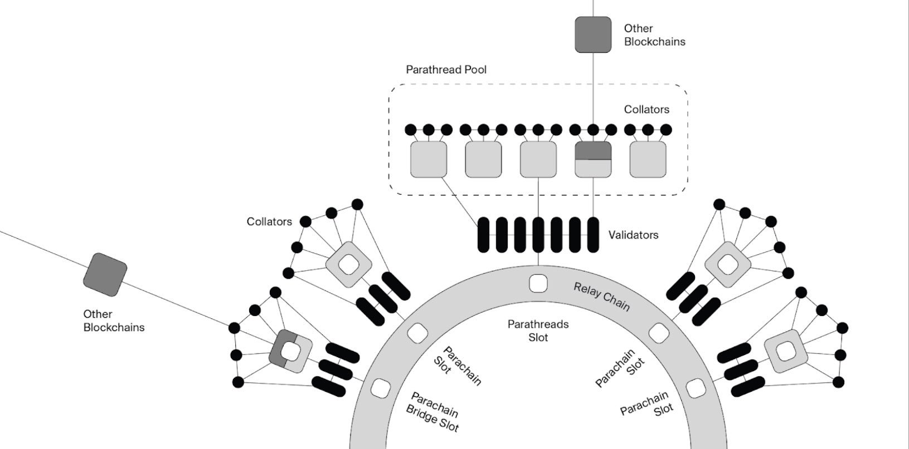

# Parathreads

Parathreads are a way for parachains to benefit from Polkadot's security and connectivity without needing to lease a dedicated parachain slot. This is done through economically sharing the scarce resource of a _parachain slot_ among a number of competing resources (parathreads). Chains that otherwise would not be able to acquire a full parachain slot are enabled to still participate in Polkadot on a pay-as-you-go basis. It also offers graceful on and off-ramps to applications in the Polkadot ecosystem. Incoming applications can start interacting with Polkadot before raising funds to lease a slot, while parachains can downgrade to a parathread to recover their bond and still remain connected to and secured by Polkadot.

## Origin

According to [this talk](https://v.douyu.com/show/a4Jj7llO5q47Dk01) in Chengdu, the origin of the idea came from similar notions in the limited resource of memory on early personal computers of the late '80s and '90s. Since computers have a limited amount of physical memory, when an application needs more, the computer can create virtual memory by using _swap space_ on a hard disk. Swap space allows the capacity of a computer's memory to expand and for more processes to run concurrently with the trade-off that some processes will take longer to progress.

## Parachain vs. Parathread

Parachains and parathreads are very similar from a development perspective. One can imagine that a chain developed with Substrate can at different points in its lifetime assume one of three states: 1) independent chain with secured bridge, 2) parachain, or 3) parathread. It can switch between these last two states with relatively minimal effort on behalf of developers since the difference is more of an economic distinction than a technological one.

Parathreads have the exact same benefits for connecting to Polkadot that a full parachain would. Namely, it is able to send messages to other para{chains,threads} through ICMP and it is secured under the full economic security of Polkadot's validator set. 

The difference between parachains and parathreads is economic. Parachains must be registered through a normal means of Polkadot, i.e. governance proposal or parachain slot auction. Parathreads have a fixed fee for registration that will be much lower than the cost of acquiring a parachain slot. Similar to how DOTs are locked for the duration of parachain slots and then returned to the winner of the auction, the deposit for a parathread will be returned to the parathread after the conclusion of its term.

For some applications, being a parathread simply makes more sense than being a parachain. Namely, these are applications that do not have frequent state updates. Take a domain name service, for example. Read requests come in large numbers, but it would be normal to update the registry on an hourly basis. DNS has no need of Polkadot’s six-second block time. Oracles also make sense as parathreads, say a daily weather or Bitcoin block oracle.

Registration of the parathread does not guarantee anything more than the registration of the parathread code to the Polkadot relay chain. When a parathread want to progress (add a block to its chain), it participates in an auction that takes place every relay chain block. The parathreads with the highest bids will be able to submit a block to the next relay chain block. All parathreads compete in this auction for their parathread to be finalized by the relay chain.

There are two interesting observations to make about parathreads. One, since they compete on a per-block basis, it is similar to how transactions are included in Bitcoin or Ethereum. This means that a similar fee market will likely develop, which means that busier times will drive the price of parathread inclusion up, while times of low activity will require lower fees. Two, this mechanism is markedly different from the parachain one, which guarantees inclusion as long as a parachain slot is held; parathread registration grants no such right to the parathread.

## How Will Parathreads be Operated?

A portion of the parachain slots will be designated as part of the parathread pool. In other words, some parachain slots will have no parachain attached to them and rather will be used as a space for which the winner(s) of the block-by-block parathread fee auction can have their block candidate included. 

Collators will offer a bid denominated in DOTs for inclusion of a parathread block candidate. The relay chain block author is able to select from these bids to include a parathread block. The obvious incentive is for them to accept the block candidates with the highest bids, which would bring them the most profit. The tokens from the parathread bids will likely be split 80-20, meaning that 80% goes into Polkadot treasury and 20% goes to the block author. This is the same split that applies also to transaction fees and, like many other parameters in Polkadot, can be changed through a governance mechanism.

For a precise description of the parathread protocol, see [here](https://hackmd.io/UcOOzoyDR9WJpQBZICtg3Q?both#Parathread-Protocol).

## Parathread Economics

There are two sources of compensation for collators:

1. Native currency inflation. The parathread could offer a block reward that increases as more relay chain blocks pass since the last parathread block. When this block reward is worth more than the bid in DOTs, the collator will participate in the auction. (This means that the collator will need to understand the exchange rate between the native currency and DOT.)
2. A DOT treasury. As a parathread can have its own DOT account, it could fund this treasury with DOTs and allow its collators to use them to bid in parathread auctions.

## Parachain Slot Swaps

It will be possible for a parachain that holds a parachain slot to swap this slot with a parathread so that the parathread "upgrades" to a full parachain and the parachain becomes a parathread. Similarly, this provides a graceful off-ramp for parachains that have reached the end of their lease and do not have sufficient usage to justify renewal; they can remain registered on the relay chain but only produce new blocks when they need to. Parathreads help ease the sharp stop of the parachain slot term by allowing parachains that are still doing something useful to produce blocks.
