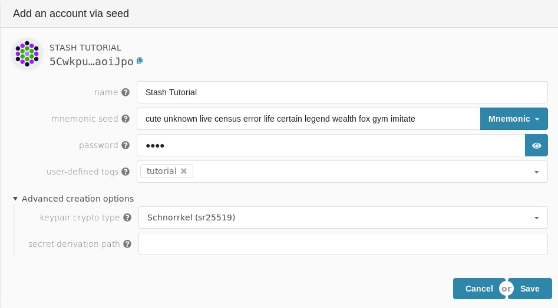
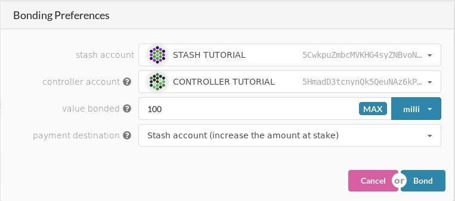
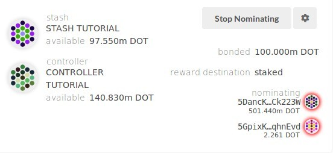
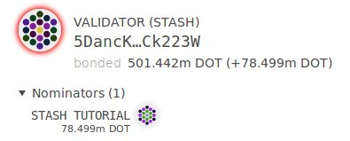

# How to nominate

This guide will walk you through how to nominate your DOTs to a validator node so that you can take part in the staking system and earn fresh DOTs. 

It has been updated for the Alexander testnet and Polkadot release PoC-4.

## Create `stash` and `controller` accounts

We will assume that you will be starting with two fresh accounts. Click [here](../../learn/staking.md#accounts) to learn more about what `stash` and `controller` accounts mean.

The first step is to create two accounts by going to the *Accounts* tab on the Polkadot Dashboard and clicking on [*Add account*](https://polkadot.js.org/apps/#/accounts). Make sure to use `stash` and `controller` in the names of your accounts to identify them easily.

Once you've created your accounts you will need to acquire some DOTs. See the [DOTs page](../../learn/DOT.md#getting-testnet-dots) for recommendations on getting testnet DOTs. Each of your accounts should have at least 150 milli-DOTs to cover the existential deposit and transaction fees.

## Nominating

It is now time to setup our nominator. We will do the following:
- Bound the DOTs of the `stash` account. These DOTs will be put at stake for the security of the network and can be slashed.
- Select the `controller` as.. the controller. This is the account that will decide when to start or stop nominating.

First, go to [Staking > Account actions](https://polkadot.js.org/apps/#/staking/actions) section. Click on the "New stake" button.

- **Stash account** - Select your `stash` account, we will bound 100mili Dots, make sure it has this amount of funds.
- **Controller account** - select the `controller` account created earlier.
- **Value bonded** - how many DOTs from the `stash` account you want to bond/stake. You can top up this amount and bound more DOTs later, however, withdrawing any bounded amount requires the bounding duration period to be over (several months at the time of writing).
- **Payment destination** - where the rewards get sent. More info [here](../../learn/staking.md#reward-distribution).

Once everything is filled properly, click `Bond` and sign the transaction (with your `stash` account).

## Nominating a validator

Go to the *Staking Overview* tab on the staking page of the Polkadot Dashboard. On the left side you will see a list of validators (on the right side are validators who have signaled intention to join the validator set and you can ignore them for now). From this list of validators, find one that you would like to nominate and copy its address (by clicking on the identicon).

Go back to the *Account Actions* tab and click the `Nominate` button. Fill in the blank field with the address of the validators you have chosen to nominate. After signing and submitting your transaction the two buttons should turn into one that says `Stop Nominating` and you should see the `stash` accounts you are nominating showing up as `Nominating`. Your nomination will be effective in the next era (this can take up to 1h).

**Congratulations!** You are now a nominator.

If you return to the *Staking Overview* tab after an era has changed and scroll until you find your validator you should see your own `stash` account appear as one of the nominators.

## How to stop nominating

To stop nominating simply return to the *Account Actions* tab and click the `Stop Nominating` button. Your account will be set to `chill` and at the next era will no longer be nominating to the validator. This may take up to an hour to take effect!
