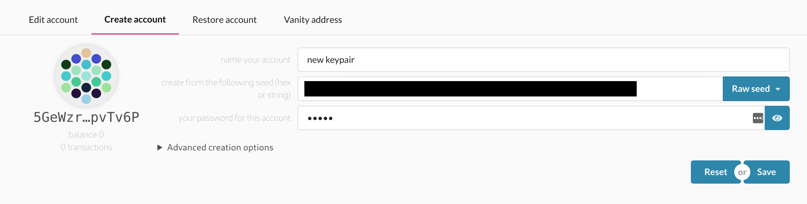
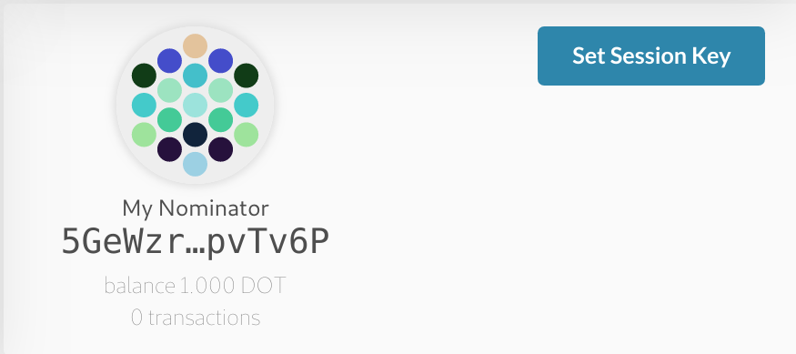
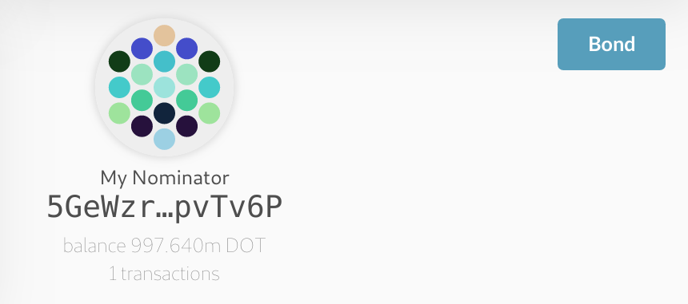
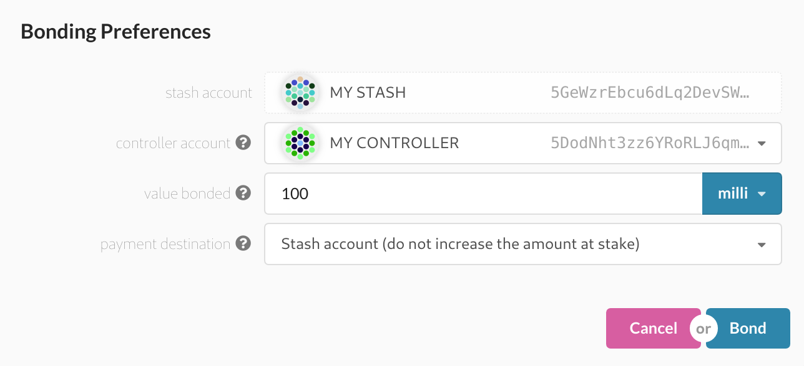
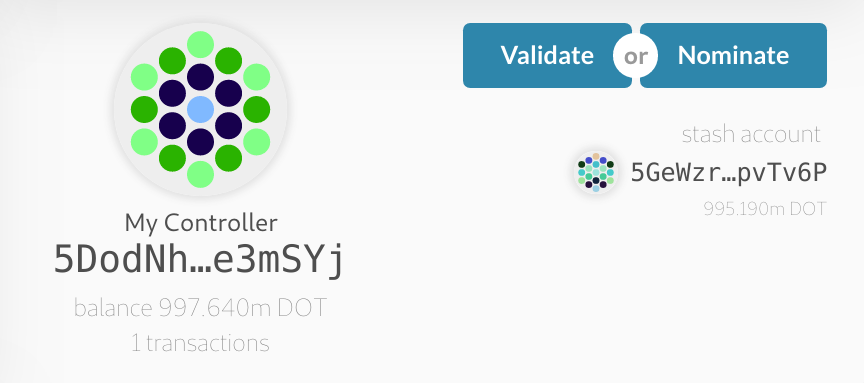
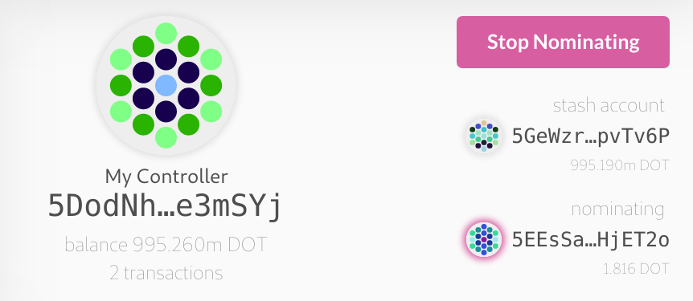

# How to nominate

This guide will walk you through how to nominate your DOTs to a validator node so that you can take part in the staking system and earn fresh DOTs. 

It has been updated for the Alexander testnet and Polkadot release PoC-4.

## Create `Stash` and `Controller` account

We will assume that you will be starting with two fresh accounts. If you already have a `stash` and `controller` account and DOTs for which to nominate with, go ahead and skip to the next section.

The first step is to create two accounts on the [Polkadot Dashboard](https://polkadot.js.org/apps/#/accounts/create). Name one account `My Stash` and another account `My Controller`.

After you've created your accounts you will need to acquire some DOTs. See the [DOTs page](../../learn/DOT.md#getting-testnet-dots) for recommendations on getting testnet DOTs. Each of your accounts should have at least 150 milli-DOTs to cover the existential deposit and transaction fees.

## Nominating with your accounts

Go to the staking tab on the Polkadot Dashboard and click on the [account actions](https://polkadot.js.org/apps/#/staking/actions) tab.

Here you will see your created accounts with the options for actions available as buttons in the top right. Your new accounts should have the option to `Set Session Key` available as shown in the picture.

Click the `Set Session Key` button and sign the extrinsic by unlocking your account. After the extrinsic has been included in the next block, the button should change to read `Bond`. Do this for both your `Stash` and `Controller` accounts.

With your `Stash` account click on the `Bond` button and set the controller to your `Controller` account. For the value, you can use most but not all of the funds in your stash account (you want some left over to cover any transaction fees). You have three options for the payee:

- Pay to your `Stash` account increasing the amount at stake.
- Pay to your `Stash` account keeping constant the amount at stake.
- Pay to your `Controller` account.

For this guide we go with the second option to pay to the `Stash` account without increasing the amount at stake.

Unlock your account and sign the extrinsic, when the transaction is included in the next block you should see two new buttons available on your `Controller` account, `Validate` and `Nominate`.

## Nominating a validator

Go to the `Staking Overview` tab on the staking page of the Polkadot Dashboard. On the left side you will see a list of validators (on the right side are validators who have signalled intention to join the validator set and you can ignore them for now). From this list of validators, find one that you would like to nominate for and copy the address.

Go back to the `Account Actions` tab and click the `Nominate` button on your `Controller` account. Fill in the blank field with the address of the validator you have chosen to nominate. After signing and submitting your transaction the two buttons should turn into one pink button that says `Stop Nominating` and you should see your `Stash` account and the validator you are nominating show up in the box.

**Congratulations!** You are now a nominator.

If you return to the `Staking Overview` page and scroll until you find your validator you should see your own `Stash` account appear as one of the nominators.

## How to stop nominating

To stop nominating simply return to the `Account Actions` tab and click the `Stop Nominating` button. Your account will be set to `chill` and at the next era will no longer be nominating to the validator. This may take up to an hour to take effect!
