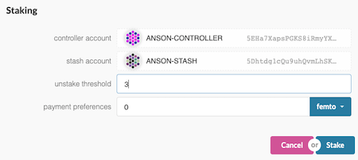

# How to validate

!!! info
    _This tutorial works with current Alexander testnet and has been updated for PoC-4._

To be a good validator, you should

- Have certain amount of DOT stake (**Basic Requirement**)
- Keep your node up to the latest version
- Have enough knowledge on network security to create a robust network
- Use HSM (Hardware Security Module) to protect your key (**Highly Recommend**)

You should **NOT** run a validator if you have DOTs, but you do not have enough technical knowledge to set up a validator. It is recommended to delegate / nominate your DOTs to someone you trust for helping you to do this kind of work. 

As a nominator, you can still get the rewards by nominating multiple validators. If you want to know more about nominator, please see [here](../nominator.md).

For this tutorial, we use Ubuntu 18.04 and will be running on PoC-4 Alexander testnet. No matter what operating system you are using, setup should not be too much difference. There is a lot of [VPS](#vps-list) choice out there, feel free to pick one you like.
 
!!! attention
    _Please make sure that you do **NOT** use this setup & configuration on mainnet. This guide simply walks you through step-by-step how to set up & run a validator node. If you would like to run a validator seriously when mainnet is live, you have to be REALLY careful on some areas like key management, DDOS protection and high availability._

## Install rust

```bash
curl https://sh.rustup.rs -sSf | sh
sudo apt install make clang pkg-config libssl-dev
```
This command will fetch the latest version of Rust and install it, then execute the second command to install required software before install Polkadot.

```bash
rustup update
```
If you have installed rust already, run this command to check whether there is a new version available.

## Install `polkadot` PoC-4

Until support for the one-line installer is back up for PoC-4, you will need to build `polkadot` from source.

```bash
git clone https://github.com/paritytech/polkadot.git
# To update your node. Run from this step.
cd polkadot
cargo clean
git checkout v0.4
git pull origin v0.4
./scripts/init.sh
./scripts/build.sh
cargo install --path ./ --force
```

This may take a while depending on your hardware!

## Synchronize chain data

After installing all related dependencies, you can start your polkadot node. Start to synchronize the chain by executing the following command:

```bash
polkadot --chain alex
```

It should take at least few hours.

You can check the current highest block via [Telemetry](https://telemetry.polkadot.io/#/Alexander) or [PolkadotJS Block Explorer](https://polkadot.js.org/apps/#/explorer)
 
## Create accounts

To be a validator, you also have to create two separate accounts for managing your funds, namely `Stash` and `Controller`. If you want to know more about it, please see [here](../../learn/staking.md#accounts). And there is additional `Session` key to represent your validator when running the node. Basically, you can use the controller account to be the session key.


First, go to [PolkadotJS => Account](https://polkadot.js.org/apps/#/accounts) & click *Create account* tab, then input your account name, save the seed, and input your password for this account. 


You can then click *Save* and choose *Create and backup account* to store your seed file to other place.

Repeat the above steps to create one more account.

## Get testnet DOTs token

To continue the following steps, you are required to get some testnet DOTs token for `Stash` and `Controller` account in order to submit transactions and stake to be a validator.

Please go to [Polkadot Watercooler - Riot](https://riot.im/app/#/room/#polkadot-watercooler:matrix.org) channel, paste your account address to ask for testnet DOTs.
 
You can also get some small testnet DOTs on [Blockxlabs](https://faucets.blockxlabs.com/polkadot) as well ;)

## Pair Accounts

First, go to [Staking](https://polkadot.js.org/apps/#/staking/actions) section, you should see all of your existing accounts.

When you have made a decision which account you will be using to be stash, you can click `Set Session Key` and then submit a transaction.

After the transaction has gone through successfully, you should see there is a `Bond` button. Click it and then select your another account which you just created before to be a controller that is mainly for managing account operations.  


**Value bonded** - how many DOTs you want to bond to this controller for staking

**Payment destination** - where your rewards get sent

If everything is inputted properly, click `Bond`.

## Staking

Once the transaction is successfully executed, you should see the controller has `Validate` and `Nominate` options available.


Select `Validate`. 



**Unstake threshold** - after your validator have been reported to be offline a number of times, you will be slashed

**Payment preferences** - rewards you will get before splitting to your nominators

Click `Stake`

Open your terminal, if your node is fully synchronized, run your validator with the `Controller` seed.

```bash
polkadot --validator --key CONTROLLER_SEED --name SHOW_ON_TELEMETRY
```

Then go to [Telemetry](https://telemetry.polkadot.io/#/Alexander), after wait few seconds, your node information will be shown.


Go to Staking tab, you should see a list of active validators out there. At the top of the page, it shows how many validators slots are available and how many nodes are intended to be a validator.


Your node will be shown on the *next up* queue. In next era(probably 1 hour), if there is slot available, your node will become an active validator. 

**Congratulations!**

> If you want to run your validator as a systemd process see the short guide [here](./how-to-systemd.md).

**Notice:** As mainnet get closer, you can expect more slots will be available for testing.

## VPS List

* [OVH](https://www.ovh.com.au/)
* [Digital Ocean](https://www.digitalocean.com/)
* [Vultr](https://www.vultr.com/)
* [Linode](https://www.linode.com/)
* [Contabo](https://contabo.com/)
* [Scaleway](https://www.scaleway.com/)
