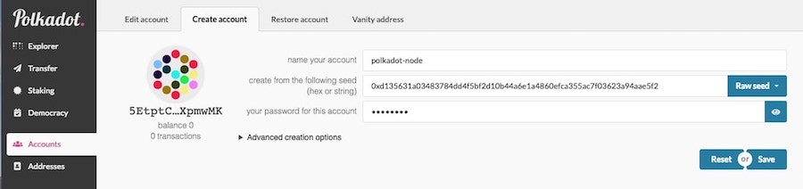
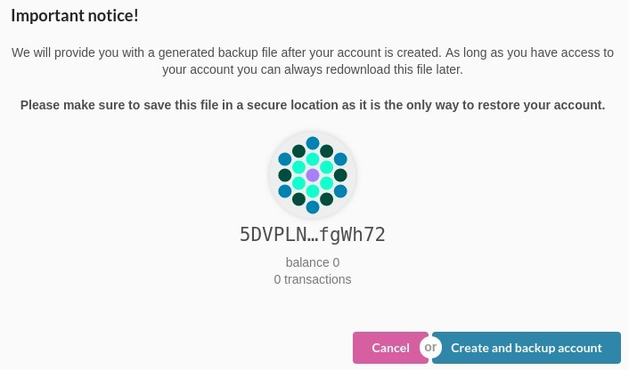
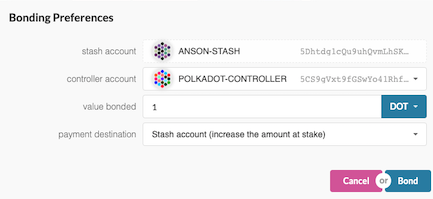
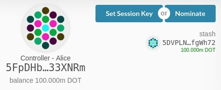
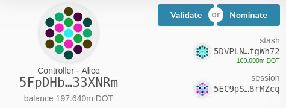
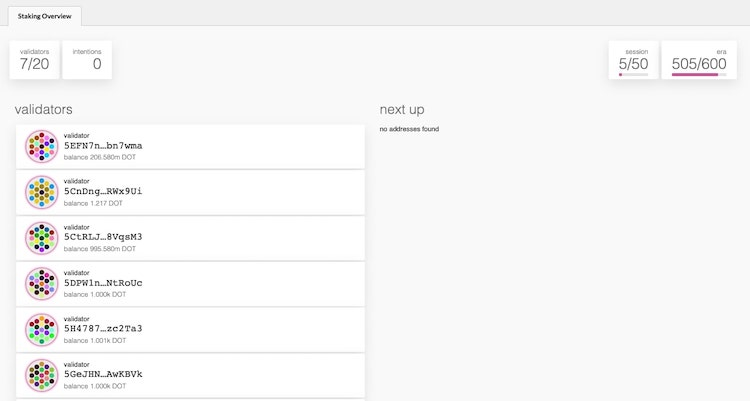
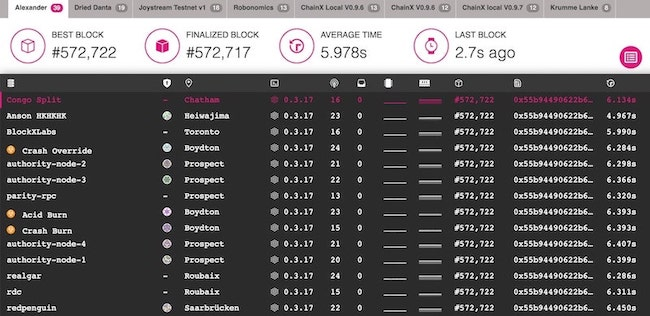
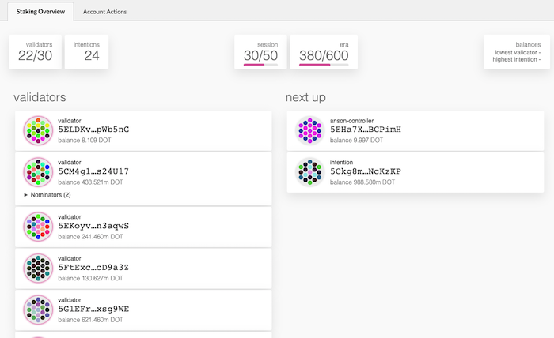

# How to validate

!!! info
    _This tutorial works with current Alexander testnet and has been updated for PoC-4._

To be a good validator, you should

- Have DOTs to stake (**Basic Requirement**)
- Keep your node up to the latest version
- Have enough knowledge of network security to create a robust network
- Use HSM (Hardware Security Module) to protect your key (**Highly Recommended**)

You should **NOT** run a validator if you have DOTs, but you do not have enough technical knowledge to set up a validator. It is recommended to delegate/nominate your DOTs to someone you trust for helping you to do this kind of work. 

As a nominator, you can still get the rewards by nominating multiple validators. If you want to know more about nominator, please see [here](../nominator.md).

For this tutorial, we use Ubuntu 18.04 and will be running on PoC-4 Alexander testnet. No matter what operating system you are using, setup should not be too much difference. There is a lot of [VPS](#vps-list) choice out there, feel free to pick one you like.
 
!!! attention
    _Please make sure that you do **NOT** use this setup & configuration on mainnet. This guide simply walks you through step-by-step how to set up & run a validator node. If you would like to run a validator seriously when mainnet is live, you have to be REALLY careful on some areas like key management, DDOS protection and high availability._

## Install rust

```bash
curl https://sh.rustup.rs -sSf | sh
sudo apt install make clang pkg-config libssl-dev
```
This command will fetch the latest version of Rust and install it, then execute the second command to install the required software before installing Polkadot.

```bash
rustup update
```
If you have installed rust already, run this command to check whether there is a new version available.

## Install `polkadot` PoC-4

Until support for the one-line installer is back up for PoC-4, you will need to build `polkadot` from source.

```bash
git clone https://github.com/paritytech/polkadot.git
# To update your node. Run from this step.
cd polkadot
cargo clean
git checkout v0.4
git pull origin v0.4
./scripts/init.sh
./scripts/build.sh
cargo install --path ./ --force
```

This may take a while depending on your hardware!

## Synchronize chain data

After installing all related dependencies, you can start your Polkadot node. Start to synchronize the chain by executing the following command:

```bash
polkadot --chain alex
```

It should take at least a few hours.

You can check the current highest block via [Telemetry](https://telemetry.polkadot.io/#/Alexander) or [PolkadotJS Block Explorer](https://polkadot.js.org/apps/#/explorer)
 
## Create accounts

The first thing you will need to do is create three separate accounts for managing funds and operating the validator.

These three keys are:

- Stash
- Controller
- Session (**Must be `ed25519`**)

If you would like to learn more about these three keys and why they are needed see [here](../../learn/keys.md).



On the Polkadot Dashboard to navigate to the [account](https://polkadot.js.org/apps/#/accounts) page and click the `Create account` tab.

To simplify everything and identify your accounts easily, it is recommended to use `Stash`, `Controller` and `Session` (or some variation like `1337_Stash`, `1337_Controller`, `1337_Session`) to name your accounts.

For the stash and controller accounts, it is allowed to use the default `sr25519` cryptography for key derivation. **But**, when you create the **Session** key make sure to choose instead the `Edwards (ed25519)` option as a `Key pair crypto type` in the `Advanced creation options`. Also make sure to select `Raw seed` and save it somewhere, since we will be using it later as a command line flag when we start the validating node.

For each account, input a password to encrypt the seed and click on `Save`.



On the following screen, choose *Create and backup account* to store your JSON key file on your computer. Together with your password, this is a way to recover each account.

Follow these steps for all 3 accounts. At the end of this section you should have three fresh accounts.

## Get testnet DOTs token

To continue the following steps, you will need to get some testnet DOTs for the `Stash` and `Controller` accounts in order to submit transactions and to stake. The `Session` account will not need any DOTs and it is recommended not to send any to it. Note that your accounts (`Stash` and `Controller`) need to have more than 100 mDOTs (i.e. 0.1 DOTs) as this is the minimum amount required for an account to exist. Having more allows you to pay for transactions fees.

To get testnet DOTs, you have a few options.

- [Polkadot Faucet](https://faucet.polkadot.chat) - Post a tweet with your address and request up to 300 mDOTs every 24 hours.
- [Blockxlabs Faucet](https://faucets.blockxlabs.com/polkadot) - A faucet which requires email sign-in.

If the above two methods do not work then you may ask in the [Polkadot Watercooler](https://riot.im/app/#/room/#polkadot-watercooler:matrix.org) channel on Riot, paste your account address and ask for testnet DOTs. You can paste one account and transfer some of the DOTs received to the other account.
 
## Bond DOTs

It is now time to setup our validator. We will do the following:

- Bond the DOTs of the `Stash` account. These DOTs will be put at stake for the security of the network and can be slashed.
- Select the `Controller`. This is the account that will decide when to start or stop validating.
- Select the `Session`. This is the account whose seed will be used to run the node.

First, go to [Staking](https://polkadot.js.org/apps/#/staking/actions) page on the Polkadot Dashboard, you should see the accounts that you created earlier.

Select your `Stash` account, in our case it has, 200 mDOTs, and click on the `Bond Funds` button. We will bond 100 mDOTs.



- **Controller account** - select the `Controller` account created earlier.
- **Value bonded** - how many DOTs from the `Stash` account you want to bond/stake. You can't use all of it as you will need to pay for the transaction fees. You can top up this amount and bound more DOTs later, however withdrawing any bounded amount requires the bounding duration period to be over (600 blocks at the time of writing).
- **Payment destination** - where the rewards get sent. More info [here](../../learn/staking.md#reward-distribution).

Once everything is filled properly, click `Bond` and sign the transaction (with your `Stash` account).

## Setting session key

You should now see the `Controller` account has `Set Session Key` and `Nominate` options available.



Select `Set Session Key`. 


Select the `Session` account created previously and click on `Set Session Key`.

## Staking

You should see the `Controller` account has now `Validate` and `Nominate` options available.
Click on `Validate`.




- **Unstake threshold** - how often you want to be reported offline (and slashed) before being removed from the validator set.
- **Payment preferences** - rewards you will keep, the rest will be shared among you and your nominators.

Click `Stake`

Open your terminal, if your node is fully synchronized, run your validator with the seed from the `Session` account.

```bash
polkadot \
--chain alex \
--validator \
--key <SESSION_ACCOUNT_SEED> \
--name <VALIDATOR_NAME_ON_TELEMETRY> \
--telemetry-url ws://telemetry.polkadot.io:1024
```

Then go to [Telemetry](https://telemetry.polkadot.io/#/Alexander), after a few seconds, your node information will be shown.



Go to [Staking apps](https://polkadot.js.org/apps/#/staking), select the "Staking Overview" tab, and you should see the list of active validators that are currently running. At the top of the page, it shows how many validators slots are available and how many nodes are intending to be a validator.



Your node will be shown on the *next up* queue. In the next era (up to 1 hour), if there is a slot available, your node will become an active validator. 

**Congratulations!**

> If you want to run your validator as a systemd process see the short guide [here](./how-to-systemd.md).

**Notice:** As mainnet get closer, you can expect more slots will be available for testing.

## VPS List

* [OVH](https://www.ovh.com.au/)
* [Digital Ocean](https://www.digitalocean.com/)
* [Vultr](https://www.vultr.com/)
* [Linode](https://www.linode.com/)
* [Contabo](https://contabo.com/)
* [Scaleway](https://www.scaleway.com/)
