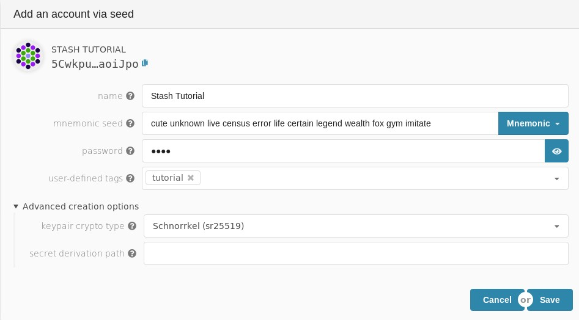
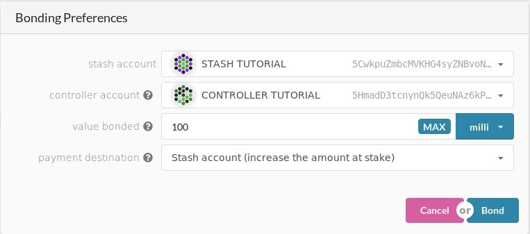

# How to validate

!!! info
    _This tutorial works with current Alexander testnet and has been updated for PoC-4._

To be a good validator, you should

- Have DOTs to stake (**Basic Requirement**)
- Keep your node up to the latest version
- Have enough knowledge of network security to create a robust network
- Use HSM (Hardware Security Module) to protect your key (**Highly Recommended**)

You should **NOT** run a validator if you have DOTs, but you do not have enough technical knowledge to set up a validator. It is recommended to delegate/nominate your DOTs to someone you trust for helping you to do this kind of work.

As a nominator, you can still get the rewards by nominating multiple validators. If you want to know more about nominator, please see [here](../nominator.md).

For this tutorial, we use Ubuntu 18.04 and will be running on PoC-4 Alexander testnet. No matter what operating system you are using, setup should not be too much difference. There is a lot of [VPS](#vps-list) choice out there, feel free to pick the one you like.

!!! attention
    _Please make sure that you do **NOT** use this setup & configuration on mainnet. This guide simply walks you through step-by-step how to set up & run a validator node. If you would like to run a validator seriously when mainnet is live, you have to be REALLY careful on some areas like key management, DDOS protection and high availability._

## Install rust

```bash
curl https://sh.rustup.rs -sSf | sh
sudo apt install make clang pkg-config libssl-dev
```
This command will fetch the latest version of Rust and install it, then execute the second command to install the required software before installing Polkadot.

```bash
rustup update
```
If you have installed rust already, run this command to check whether there is a new version available.

## Install `polkadot` PoC-4

Until support for the one-line installer is back up for PoC-4, you will need to build `polkadot` from source.

```bash
git clone https://github.com/paritytech/polkadot.git
# To update your node. Run from this step.
cd polkadot
cargo clean
git checkout v0.4
git pull origin v0.4
./scripts/init.sh
./scripts/build.sh
cargo install --path ./ --force
```

This may take a while depending on your hardware!

## Synchronize chain data

After installing all related dependencies, you can start your Polkadot node. Start to synchronize the chain by executing the following command:

```bash
polkadot --chain alex
```

It should take at least a few hours.

You can check the current highest block via [Telemetry](https://telemetry.polkadot.io/#/Alexander) or [PolkadotJS Block Explorer](https://polkadot.js.org/apps/#/explorer)

## Create accounts

To be a validator, you will need three separate accounts for managing your funds, namely `stash`, `controller` and `Session`. If you want to know more about it, please see [here](../../learn/staking.md#accounts).


First, go to [PolkadotJS => Account](https://polkadot.js.org/apps/#/accounts) and click on the `add account` button.

To help you identify your accounts easily later on, make sure to use `stash`, `controller` and `session` in the name your accounts. A mnemonic seed phrase is given to you. You can save it in a safe place, offline, or you can choose to save your account using a JSON keyfile that will be generated automatically when clicking on `Save`. The password that is required to create an account will be used to sign any transaction made for each account. It will also be used to encrypt the JSON keyfile and will be required if you wish to restore your account using this file.

The mnemonic phrase for the `session` account needs to be used later in this guide to validate. Make sure you save it safely.
Another particularity you need to be aware of: both `stash` and `controller` account can use the `Schnorrkel (sr25519)` as keypair crypto type in the `Advanced creation options`, however, **you must use `Edwards (ed25519)` for the session account.**

On the following screen, choose *Create and backup account* to store your JSON key file on your computer. Together with your password, this is a way to recover each account.

Once all accounts have been created, the overview should show you something like this. Note that the session account must be `ed25519`.


## Get testnet DOTs token

To continue the following steps, you are required to get some testnet DOTs token for the `stash` and `controller` accounts in order to submit transactions and use these DOTs as stake. The `session` account doesn't need any DOT. See the [DOTs page](../../learn/DOT.md#getting-testnet-dots) for recommendations on getting testnet DOTs. Each of your accounts should have at least 150 milliDOTs to cover the existential deposit and transaction fees.

## Bond DOTs

It is now time to setup our validator. We will do the following:
- Bound the DOTs of the `stash` account. These DOTs will be put at stake for the security of the network and can be slashed.
- Select the `controller`. This is the account that will decide when to start or stop validating.
- Select the `session` account. This is the account whose seed will be used to run the node.

First, go to [Staking](https://polkadot.js.org/apps/#/staking/actions) section. Click on the "New stake" button.




- **Stash account** - Select your `stash` account, we will bound 100 milliDOTs, make sure it has this amount of funds.
- **Controller account** - select the `controller` account created earlier.
- **Value bonded** - how many DOTs from the `stash` account you want to bond/stake. You can top up this amount and bound more DOTs later, however, withdrawing any bounded amount requires the bounding duration period to be over (several months at the time of writing).
- **Payment destination** - where the rewards get sent. More info [here](../../learn/staking.md#reward-distribution).

Once everything is filled properly, click `Bond` and sign the transaction (with your `stash` account)

## Set the session key

You should now see a new card with all your accounts. The bonded amount on the right corresponds to the funds bonded by the `stash` account.


Click on `Set Session Key`.  
Select the `session` account created previously and click on `Set Session Key`.

## Validate

You should now be able to see both `Validate` and `Nominate` buttons.
At this point and before validating, you should make sure your node is ready to validate. Open your terminal, if your node is fully synchronized, run your validator with the seed or the mnemonic from the `session` account, e.g: 
```bash
polkadot --chain alex --validator --key="SESSION_ACCOUNT_SEED" --name NAME_ON_TELEMETRY
```

Make sure that the address generated from the seed corresponds to your `session` account's address. Don't worry if the last characters diverge, it's just the checksum that has recently changed.


To verify that your node is live and in sync, head to [Telemetry](https://telemetry.polkadot.io/#/Alexander), after a few seconds, your node information will be shown.

If everything looks good, go ahead and click on `Validate` in Polkadot UI.


- **Unstake threshold** - how often you want to be reported offline (and slashed) before being removed from the validator set.
- **Payment preferences** - rewards you will keep, the rest will be shared among you and your nominators.

Click `Validate`

Go to Staking tab, you should see a list of active validators out there. At the top of the page, it shows how many validators slots are available and how many nodes are intended to be a validator.


Your node will be shown on the *next up* queue. In the next era (up to 1 hour), if there is a slot available, your node will become an active validator. 

**Congratulations!**

> If you want to run your validator as a systemd process see the short guide [here](./how-to-systemd.md).

**Notice:** As mainnet get closer, you can expect more slots will be available for testing.

## VPS List

* [OVH](https://www.ovh.com.au/)
* [Digital Ocean](https://www.digitalocean.com/)
* [Vultr](https://www.vultr.com/)
* [Linode](https://www.linode.com/)
* [Contabo](https://contabo.com/)
* [Scaleway](https://www.scaleway.com/)
