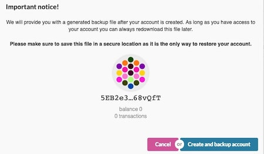

# Node Operator / Validator

Validators secure the relay chain by staking DOTs, validating proofs from collators and participating in consensus with other validators.

These participants will play a crucial role in adding new blocks to the Relay Chain and, by extension to all parachains, such that parties can complete cross-chain transactions via the Relay Chain. Validators perform two functions. First, verifying the information contained in an assigned set of parachain blocks is valid (such as the identities of the transacting parties and the subject matter of the contract). Their second role is to participate in the consensus mechanism to produce the Relay Chain blocks based on validity statements from other validators. Any instances of non-compliance with the consensus algorithms result in punishment by removal of some or all of the validator’s staked DOTs, thereby discouraging bad actors. Good performance, however, will be rewarded, with validators receiving transaction fees in the form of DOTs in exchange for their activities.

## How to run a polkadot / validator node

!!! info
    _This tutorial works with current Alexander testnet. Once PoC-4 is released, contents will be updated as well._
To be a good validator, you should

* Have certain amount of DOT stake (**Basic Requirement**)

* Keep your node up to the latest version

* Have enough knowledge on network security to create a robust network

* Use HSM (Hardware Security Module) to protect your key (**Highly Recommend**)

You should **NOT** run a validator if you have DOTs, but you do not have enough technical knowledge to set up a validator. It is recommended to delegate / nominate your DOTs to someone you trust for helping you to do this kind of work. 

As a nominator, you can still get the inflated token. If you want to know more about nominator, please come [HERE](./nominator.md).

For this tutorial, we use Ubuntu 18.04 and will be running on PoC-3 Alexander testnet. No matter what operating system you are using, setup should not be too much difference. There is a lot of [VPS](./node_operator.md#vps-list) choice out there, feel free to pick one you like.

 
!!! attention
    _Please make sure that you do **NOT** use this setup & configuration on mainnet. This guide simply walks you through step-by-step how to set up & run a validator node. If you would like to run a validator seriously when mainnet is live, you have to be REALLY careful on some areas like key management, DDOS protection and high availability._


**Update to the latest version of polkadot**

If you have installed polkadot already, you can use the following command to install the latest version and check your current version.

```bash
cargo install --git https://github.com/paritytech/polkadot.git --branch v0.3 polkadot --force
polkadot --version
```

**Install rust**

```bash
curl https://sh.rustup.rs -sSf | sh
sudo apt install make clang pkg-config libssl-dev
```
This command will fetch the latest version of Rust and install it, then execute the second command to install required software before install Polkadot.

```
rustup update
```
If you have installed rust already, run this command to check whether there is a new version available.

**Install polkadot PoC-3 alexander**

```bash
cargo install --git https://github.com/paritytech/polkadot.git --branch v0.3 polkadot
```

This command will fetch & install the polkadot 0.3 version to your PATH.


**Synchronize chain data**

After installed all related dependencies, you can start your polkadot node now. To synchronize the chain by executing the following command:

```bash
polkadot
```

It should take at least few hours.


You can check the current highest block via [Telemetry](https://telemetry.polkadot.io/#/Alexander) or [PolkadotJS Block Explorer](https://polkadot.js.org/apps/#/explorer)
 
**Create an account**

To be a validator, you also have to create an account to stake some DOTs to it. 


First, go to [PolkadotJS => Account](https://polkadot.js.org/apps/#/accounts) & click *Create account* tab, then input your account name, save the seed, and input your password for this account. 



You can then click *Save* and choose *Create and backup account* to store your seed file to other place.

After a while, if your node is fully synchronized, you can monitor your node status by executing 

```bash
polkadot --validator --key YOUR_SEED --name SHOW_ON_TELEMETRY
```

Then go to [Telemetry](https://telemetry.polkadot.io/#/Alexander), after wait few seconds, you should see your node information.


**Get testnet DOTs token**

When everything is configured correctly, you are required to get some testnet DOTs token to stake to be a validator.

Please go to [Polkadot Watercooler - Riot](https://riot.im/app/#/room/#polkadot-watercooler:matrix.org) channel, paste your account address to ask for testnet DOTs.
 
You can also get some small testnet DOTs on [Blockxlabs](https://faucets.blockxlabs.com/polkadot) as well ;)

**Staking** 

Go to Staking tab, you should see a list of active validators out there. At the top of the page, it shows how many validators slots are available and how many node are intended to be a validator.


If there is slot available, you can click *stake* under your account to express your intention. Then you should see your node will be shown on the *next up* queue. After a certain blocks(era), your node will become a validator. 

**Congratulations!**

**Notice:** As mainnet get closer, you can expect more slots will be available for testing.


## VPS List

* [OVH](https://www.ovh.com.au/)
* [Digital Ocean](https://www.digitalocean.com/)
* [Vultr](https://www.vultr.com/)
* [Linode](https://www.linode.com/)
* [Contabo](https://contabo.com/)
* [Scaleway](https://www.scaleway.com/)


## Other References

#### [How to run a Polkadot node (Docker)](https://medium.com/@acvlls/setting-up-a-polkadot-node-the-easy-way-3a885283091f)

#### [How to run a Validator node in PoC 3](https://github.com/paritytech/polkadot/wiki/Validating-on-PoC-3-%22Alexander%22)

#### [Getting Testnet DOTs](https://github.com/paritytech/polkadot/wiki/DOT#getting-dots)

## Security / Key Management

#### [Validator Security Overview](https://github.com/w3f/validator-security)

## Monitoring Tools

#### [Polkadot Telemetry Service](https://telemetry.polkadot.io/#/Alexander) - Network information including what nodes are running your chain, what software versions they are running, and sync status.

#### [Polkadash](http://polkadash.io/) - Validator monitor

## [Other Useful Links](https://forum.web3.foundation/t/useful-links-for-validators/20)